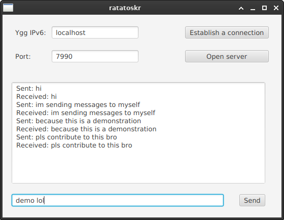

# Ratatoskr
A messenger on Yggdrasil network.


## Description

In this project I aim to create the most secure and truly decentralized messenger. I chose Yggdrasil due its low popularity, and security features like peep-to-peer architecture and end-to-end encryption. However, ratatoskr itself does not have any security features, so don't use it for private chatting, at least for now... Contributions, advices and criticism are welcome!  



## How to install
1. Install and configure yggdrasil: https://yggdrasil-network.github.io/
2. Download and install Java SDK 23.
3. Download the jar file from releases and run.
4. If you get errors with dependencies, git clone and run: 
```bash
   mvn javafx:run
```
## How to use
1. Click "Open Server" button.
2. Share your YggIP with the person you want to chat with.

You can get your YggIP by running (Linux):
```bash
   ip a
```

Or this (Windows):
```bash
   ipconfig
```
3. Establish a connection (Default port is 7990).
4. Chat !

## Bugs & Future plans
Bugs:
1. If YggIP and port are provided but receiving end hasn't started their server, app will freeze.
2. Running on Windows is problematic, if errors with dependencies occur, download JavaFX SDK and run jar file with modules of javafx added.

Future plans:
1. Fix bugs
2. Improve design
3. Add ability to multi chat
4. Create decentralized account system (IPFS maybe?)
5. Port to mobile
